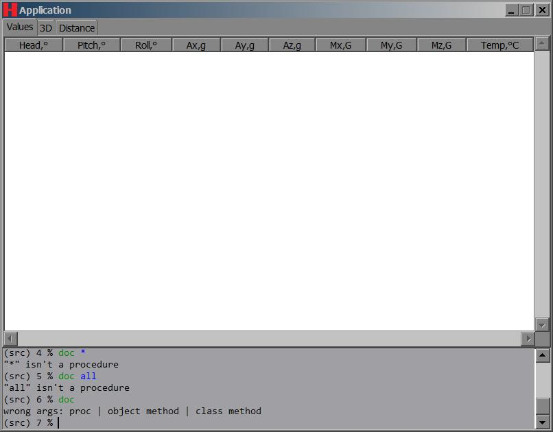
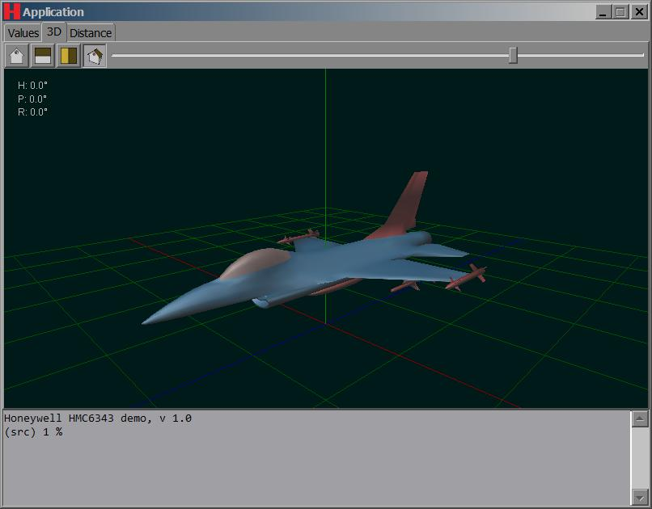
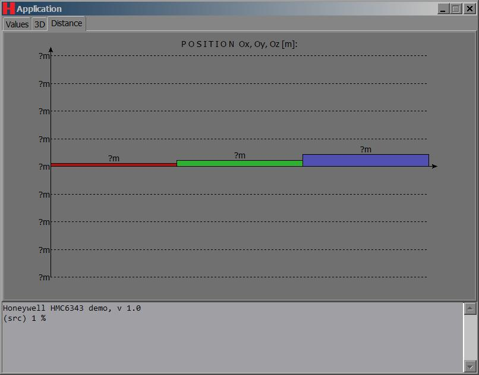

# Demo application for Honeywell HMC6343 chip #

Instead of big OEM demo application from Honeywell you can use this application,
starpack, to verify your HMC6343 chip or to check some ideas: demo app support
programmable console with OOP commands to manage ports, lists all devices and
available ports, to configure port, device, to send commands, rewrite EEPROM,
make calibration, get sensor measured samples, to see samples as 3D model, to
see path/coordinates of sensor in space and so on. HMC6343 protocol is fully
supported. For more details see "hlp.html" file. Bonus: all application is about
2,5 Mb only and does not require .NET like original Honeywell demo app and it's
portable (no installation is needed - only install drivers or install original
Honeywell demo app first).

Reading samples may be filtered, integrated, saved, etc - all of these operations
are dataflow-driven and consists of combinable with Tcl commands blocks: even
branching is possible!

It's potentially cross-platform (Tcl/Tk).
